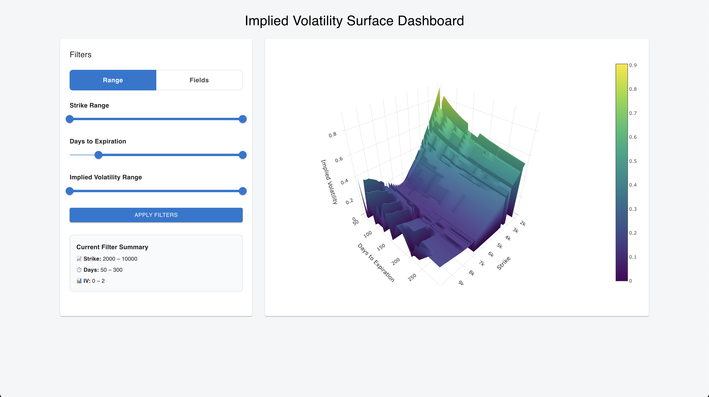

# Volatility-Visualization



## Overview

**Volatility-Visualization** is a full-stack web application for visualizing implied volatility surfaces from options data. The system features a React + TypeScript frontend and a Django backend. Users can interactively filter and explore data loaded from a static CSV file.

---

## Features

- **3D Implied Volatility Surface Plot**: Visualizes the relationship between strike price, days to expiration, and implied volatility.
- **Interactive Filtering**: Adjust strike, days to expiration, and implied volatility ranges using sliders or input fields.
- **Data from CSV**: All data is loaded from a static CSV file on the backend.
- **Summary Panel**: Displays the current filter settings.
- **Modern UI**: Built with Material-UI and Plotly.js for a responsive, user-friendly experience.

---

## Project Structure

```
.
├── backend/
│   ├── core/           # Django project settings and URLs
│   ├── dashboard/      # Django app with API endpoints
│   ├── data.csv        # Source data for visualization
│   └── manage.py
├── frontend/
│   ├── src/
│   │   ├── components/
│   │   │   └── VolatilityPlot.tsx  # Main visualization component
│   │   └── App.tsx, index.tsx, etc.
│   ├── package.json
│   └── public/
├── Sample-Image.png    # Example output image
└── README.md
```

---

## Backend

- **Framework**: Django (Python)
- **API Endpoints**:
  - `GET /api/metadata/`: Returns min/max values for strike, days to expiration, and implied volatility (from `data.csv`).
  - `GET /api/data/`: Returns filtered data for visualization, based on query parameters (from `data.csv`).
- **Data Source**: `backend/data.csv` (columns: `strike`, `days_to_expiration`, `implied_volatility`)

---

## Frontend

- **Framework**: React + TypeScript
- **Main Component**: `VolatilityPlot.tsx` (handles data fetching, filtering, and rendering the 3D surface plot)
- **UI Libraries**: Material-UI, Plotly.js
- **Entry Point**: `App.tsx` renders the main visualization component

---

## Getting Started

### Prerequisites

- **Backend**: Python 3.8+, Django, pandas
- **Frontend**: Node.js (v16+), npm

### Backend Setup

```bash
cd backend
pip install django pandas
python manage.py runserver
```
The API will be available at `http://localhost:8000/api/`.

### Frontend Setup

```bash
cd frontend
npm install
npm start
```
The app will run at `http://localhost:3000/`.

---

## Data Format

The backend uses a CSV file (`backend/data.csv`) with the following columns:

| strike | days_to_expiration | implied_volatility |
|--------|--------------------|-------------------|
| 2400.0 | 10                 | 1.6472            |
| ...    | ...                | ...               |

---

## Customization

- To use your own data, replace `backend/data.csv` with a file of the same format.
- Adjust frontend or backend code as needed for additional features.

---

## License

This project is for educational and demonstration purposes.

---

## Acknowledgements

- [React](https://react.dev/)
- [Django](https://www.djangoproject.com/)
- [Plotly.js](https://plotly.com/javascript/)
- [Material-UI](https://mui.com/)
